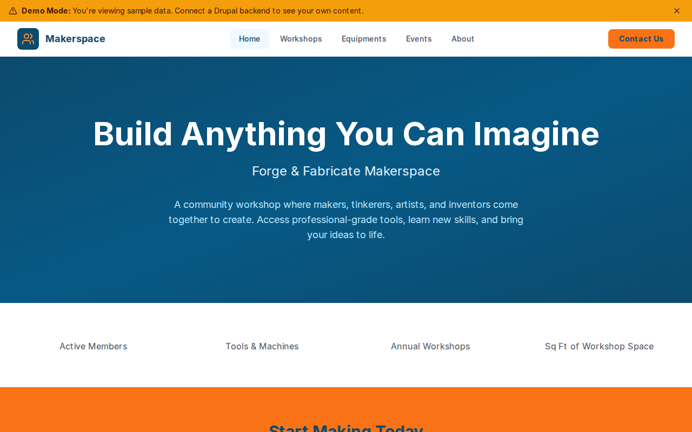

# Decoupled Makerspace

A community workshop and makerspace website starter template for Decoupled Drupal + Next.js. Built for makerspaces, fab labs, hackerspaces, and community workshops that need to showcase equipment, list workshops, and promote community events.



## Features

- **Workshop Listings** - Upcoming classes with dates, skill levels, pricing, instructor info, and max capacity
- **Equipment Directory** - Tools and machines with categories, brand/model details, certification requirements, and availability
- **Community Events** - Maker faires, open houses, hackathons with dates, locations, and public/members-only flags
- **Homepage** - Hero section with makerspace stats, featured workshops, and membership call-to-action
- **Static Pages** - About, membership info, and other informational pages
- **Modern Design** - Clean, accessible UI optimized for maker community content

## Quick Start

### 1. Clone the template

```bash
npx degit nextagencyio/decoupled-makerspace my-makerspace
cd my-makerspace
npm install
```

### 2. Run interactive setup

```bash
npm run setup
```

This interactive script will:
- Authenticate with Decoupled.io (opens browser)
- Create a new Drupal space
- Wait for provisioning (~90 seconds)
- Configure your `.env.local` file
- Import sample content

### 3. Start development

```bash
npm run dev
```

Visit [http://localhost:3000](http://localhost:3000)

---

## Manual Setup

If you prefer to run each step manually:

<details>
<summary>Click to expand manual setup steps</summary>

### Authenticate with Decoupled.io

```bash
npx decoupled-cli@latest auth login
```

### Create a Drupal space

```bash
npx decoupled-cli@latest spaces create "My Makerspace"
```

Note the space ID returned (e.g., `Space ID: 1234`). Wait ~90 seconds for provisioning.

### Configure environment

```bash
npx decoupled-cli@latest spaces env 1234 --write .env.local
```

### Import content

```bash
npm run setup-content
```

This imports:
- Homepage with hero, statistics, and CTAs
- 3 Workshops (Woodworking, 3D Printing, MIG Welding)
- 3 Equipment items (Laser Cutter, CNC Router, 3D Printers)
- 3 Community Events (Mini Maker Faire, Open House, Hardware Hackathon)
- 2 Static Pages (About, Membership)

</details>

## Content Types

### Workshop
- Title, Body (detailed description)
- Workshop Date, Duration
- Skill Level, Instructor Name
- Price, Max Participants
- Workshop Image

### Equipment
- Title, Body (capabilities and specs)
- Category (Digital Fabrication, Woodshop, etc.)
- Brand & Model
- Certification Required (boolean)
- Availability Hours
- Equipment Image

### Community Event
- Title, Body (event details)
- Event Date, End Date
- Location
- Open to Public (boolean)
- Event Image

### Homepage
- Hero Title, Subtitle, Description
- Statistics (paragraph items with number and label)
- Featured Items Title
- CTA Title, Description, Primary and Secondary buttons

## Customization

### Colors & Branding
Edit `tailwind.config.js` to customize colors, fonts, and spacing.

### Content Structure
Modify `data/makerspace-content.json` to add or change content types and sample content.

### Components
React components are in `app/components/`. Update them to match your design needs.

## Demo Mode

Demo mode allows you to showcase the application without connecting to a Drupal backend. It displays mock content for the homepage, workshops, equipment, and events.

### Enable Demo Mode

Set the environment variable:

```bash
NEXT_PUBLIC_DEMO_MODE=true
```

Or add to `.env.local`:
```
NEXT_PUBLIC_DEMO_MODE=true
```

### What Demo Mode Does

- Shows a "Demo Mode" banner at the top of the page
- Returns mock data for all GraphQL queries
- Displays sample workshops, equipment, and community events
- No Drupal backend required

### Removing Demo Mode

To convert to a production app with real data:

1. Delete `lib/demo-mode.ts`
2. Delete `data/mock/` directory
3. Delete `app/components/DemoModeBanner.tsx`
4. Remove `DemoModeBanner` from `app/layout.tsx`
5. Remove demo mode checks from `app/api/graphql/route.ts`

## Deployment

### Vercel (Recommended)
[](https://vercel.com/new/clone?repository-url=https://github.com/nextagencyio/decoupled-makerspace)

Set `NEXT_PUBLIC_DEMO_MODE=true` in Vercel environment variables for a demo deployment.

### Other Platforms
Works with any Node.js hosting platform that supports Next.js.

## Documentation

- [Decoupled.io Docs](https://www.decoupled.io/docs)
- [Next.js Documentation](https://nextjs.org/docs)
- [Drupal GraphQL](https://www.decoupled.io/docs/graphql)

## License

MIT
